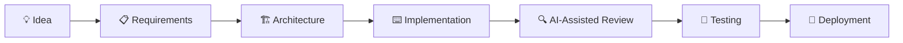

<div align="center">


<br/>


<br/><br/>

<a href="https://github.com/anufdo"></a>
<a href="https://www.linkedin.com/in/anufdo/"></a>
<a href="https://www.youtube.com/@AnuradhaFernando"></a>

</div>

---

## 🤖 Droid Profile

```text
╔══════════════════════════════════════════════════╗
║            ANURADHA // DEVELOPER UNIT            ║
╠══════════════════════════════════════════════════╣
║ STATUS        : ONLINE                           ║
║ PRIMARY       : SOFTWARE ENGINEERING             ║
║ SPECIALTY     : NODE.JS + TYPESCRIPT             ║
║ CO-PILOTS     : CLAUDE • GITHUB COPILOT • OPENAI ║
║ MISSION       : BUILD • LEARN • IMPROVE          ║
╚══════════════════════════════════════════════════╝
```

> *"Do. Or do not. There is no try."* — Yoda
> *(Good advice for shipping to production.)*

---

## 👨🏻‍💻 About Me

I'm a software engineer focused on building **practical, maintainable applications** with modern JavaScript and TypeScript.

My strongest area is **backend development**: Node.js, APIs, databases, and business applications. I'm also exploring how **AI can improve the whole engineering process**, not just code generation, but architecture, debugging, testing, and code review.

| | |
|---|---|
| 🚀 **Building** | Real-world web and business applications |
| 🧠 **Exploring** | AI-assisted software engineering workflows |
| 🛠️ **Valuing** | Clean architecture and maintainable code |
| 🔍 **Enjoying** | Debugging and solving complex problems |
| 🤝 **Open to** | Interesting projects and collaboration |

---

## ⚡ Tech Arsenal

### 🧑‍💻 Core Stack


### 🗄️ Databases


### 🧰 Tools & DevOps


### 🤖 AI Development


**AI is my co-pilot, not my replacement.** I use it across the entire workflow:

`Architecture` → `Implementation` → `Debugging` → `Testing` → `Code Review`

---

## 🛰️ Mission Control

| Status | Focus Area |
|:---:|---|
| ✅ | AI-assisted coding with Claude and Copilot |
| ✅ | AI-powered code review |
| ✅ | Developer workflows and automation |
| ✅ | Backend engineering with Node.js |
| ✅ | Cloud and deployment |
| 🔄 | Deeper AI engineering and agent workflows |
| 🔄 | Better system architecture |

---

## 🚀 What I'm Building

### 🏪 Business Applications

Practical software for real-world business workflows:

- 🧾 Point-of-sale systems
- 👥 HR and attendance systems
- 💰 Payroll workflows
- 📦 Inventory and stock management
- 🔄 Offline-first and synchronization workflows

### 🤖 AI Engineering

Exploring how AI agents can become useful engineering teammates:



The goal isn't *"generate everything with AI."*

> **The goal is to use AI to become a better engineer.**

---

## 📊 GitHub Command Center

<div align="center">


<br/>


<br/>


</div>

---

## 📡 Open Comms Channel

<div align="center">

```text
┌──────────────────────────────────────────────┐
│                                              │
│   SYSTEMS OPERATIONAL      ● ● ● ● ● ● ○     │
│   COFFEE LEVEL             ████████░░        │
│   BUGS DETECTED            ███░░░░░░░        │
│   CLAUDE CO-PILOT          ONLINE            │
│                                              │
│        "May the Force be with you."          │
│                                              │
└──────────────────────────────────────────────┘
```

**Keep building. Keep learning. Keep exploring.** ⭐


</div>
